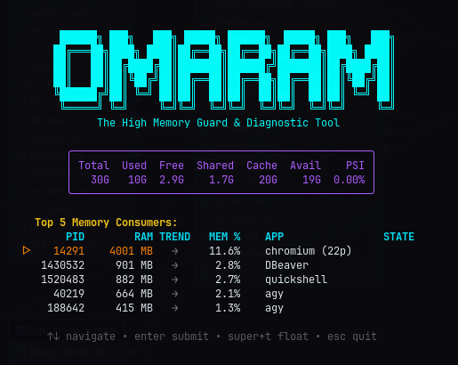

# Omarchy Memory Guard



A native Omarchy shell widget that monitors system memory and provides an interactive terminal UI for pausing or killing memory-heavy processes.

## Features
- **Live Memory Indicator:** Changes from normal to amber (75%+) to red (90%+) on your top bar.
- **Floating Interactive Manager:** Clicking the widget opens an Omarchy floating terminal with a gorgeous interactive UI powered by `gum`.
- **Safe Process Management:** Lists the top 5 memory-hungry applications dynamically. Allows you to confidently hit `Pause (SIGSTOP)` to stop them from eating more memory without losing your unsaved work, or `Kill (SIGKILL)` if you need them gone instantly.
- **Hardened Security:** Escapes process names explicitly to prevent terminal injection, strictly limits memory actions to user-owned apps.

## Installation

Add this plugin to Omarchy using the CLI:
```bash
omarchy plugin add https://github.com/layolayo/omarchy-memory-guard
```

## Setup

Move the widget into your bar:
```bash
omarchy bar put io.github.layolayo.memory-guard --section center
```
